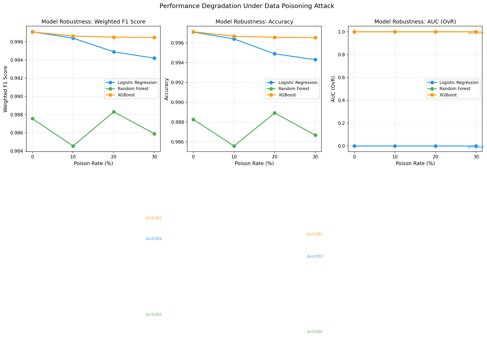
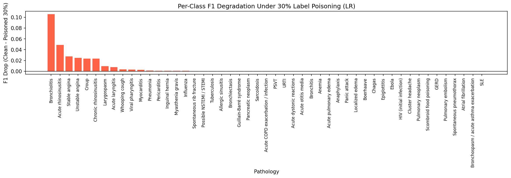

# Medical Diagnosis Prediction with Data Poisoning Analysis

This project focuses on building a machine learning pipeline for **medical diagnosis prediction** using the DDXPlus dataset, along with a comprehensive **data poisoning experiment** to evaluate model robustness under adversarial conditions.

---
Repo link: [ML_Project_DDXPLUS.git](https://github.com/AhmadHakim119/ML_Project_DDXPLUS.git)

##  Project Overview

The project includes:

- Data preprocessing and feature engineering
- Training multiple machine learning models
- Performance evaluation using various metrics
- Ensemble learning (Voting Classifier)
- Data poisoning experiments to assess robustness
- Analysis of how model performance degrades under attack

---

##  Models Used

CLASSIFIERS:
1. Logistic Regression     — linear, probabilistic, sparse-friendly
2. Decision Tree           — non-linear, interpretable, no scaling needed
3. Random Forest           — ensemble of trees, strong baseline
4. SVM (LinearSVC)         — linear kernel, scales to 1.3M samples
NOTE: standard SVC is O(n²) — unusable at this scale CalibratedClassifierCV(cv='prefit') adds predict_proba without retraining, keeping inference fast
5. KNN    — instance-based, O(n) inference
NOTE: subsampled to 100k — full 1.3M would require searching all training points per prediction
6. XGBoost                 — gradient boosted trees, tree_method='hist' for speed
7. SGD Classifier          — online learning, memory-efficient at scale
8. Complement Naive Bayes  — probabilistic, sparse-compatible (replaces GaussianNB which requires dense arrays and fails at this size)

---

## Data Poisoning Experiment

A key part of this project is evaluating how models behave under **poisoned data conditions**:

- Simulated poisoning attacks on training data
- Measured performance degradation
- Compared per-class impact
- Generated summary statistics

---

##  Project Structure

```text
project/
├── FINAL_PROJECT_ML.ipynb     # Main notebook (Colab/Local)
├── release_conditions.json    # Metadata mapping for medical conditions
├── release_evidences.json     # Metadata mapping for patient symptoms
├── final_results_table.csv    # Final model performance
├── full_results_table.csv     # Detailed metrics (P, R, F1)
├── per_class_drop.csv         # Performance loss per diagnosis
└── poison_summary.csv         # Results of poisoning experiments
````
---

## Google Colab

The full implementation (training, experiments, and results) was developed on Google Colab:

👉 **[Open Colab Notebook Here](https://colab.research.google.com/drive/1HmScJEnwN-uhLpYCbYDZl2cKvyan1r2O?usp=sharing)**

---

## Dataset & stored variables

Due to size limitations, the dataset and stored variables are **not included** in this repository. As you can see in the notebook, we stored important each step
of the way to ensure all our work is saved and can be replicated

You can access it here:

👉 **[Dataset & Extra Link Here (Google Drive)](https://drive.google.com/drive/folders/1aiZmnT1zYPQUscss491OlCUT8WNlD17p?usp=sharing)**

---

## Installation
Clone the repository:

```bash
git clone https://github.com/AhmadHakim119/ML_Project_DDXPLUS.git
cd ML_Project_DDXPLUS
````
## Experimental Results

### 1. Baseline Performance
Before applying adversarial attacks, eight models were evaluated on 1.3 million synthetic patient records.
**Logistic Regression** and **XGBoost** emerged as the top-performing architectures.

| Model | Accuracy | Weighted F1 | AUC (OvR) | 5-Fold CV F1 |
| :--- | :--- | :--- | :--- | :--- |
| **Logistic Regression** | 0.9971 | 0.9971 | 1.0000 | 0.9975 ± 0.0002 |
| **XGBoost** | 0.9972 | 0.9972 | 1.0000 | 0.9965 ± 0.0004 |
| **Random Forest** | 0.9969 | 0.9968 | 1.0000 | 0.9961 ± 0.0009 |
| **SGD Classifier** | 0.9954 | 0.9954 | 1.0000 | 0.9887 ± 0.0020 |
| **SVM (LinearSVC)*** | 0.9971 | 0.9971 | 1.0000 | N/A |
| **KNN (100k subset)*** | 0.9858 | 0.9854 | 0.9990 | 0.9726 ± 0.0024 |
| **Complement NB** | 0.9316 | 0.9129 | 0.9994 | 0.9264 ± 0.0014 |
| **Decision Tree** | 0.7306 | 0.7265 | 0.9851 | 0.7843 ± 0.0517 |

\* Subsampled models used for preliminary comparison.

### 2. Model Robustness Under Attack
We simulated label-flipping data poisoning at escalating rates of 10%, 20%, and 30%. 
While all models showed high baseline accuracy, their resilience to corrupted labels varied].

| Model | Clean (0%) | Poisoned 10% | Poisoned 20% | Poisoned 30% | F1 Drop |
| :--- | :--- | :--- | :--- | :--- | :--- |
| **Logistic Regression** | 0.9971 | 0.9964 | 0.9949 | 0.9942 | 0.0029 |
| **Random Forest†** | 0.9876 | 0.9845 | 0.9883 | 0.9859 | 0.0017 |
| **XGBoost** | 0.9971 | 0.9966 | 0.9965 | 0.9965 | **0.0006** |

*† Lightweight configuration used for poisoning runs to manage computational constraints.* 

---

##  Visual Analysis

### Performance Degradation Curves
The following curves illustrate how Weighted F1, Accuracy, and AUC degrade as the percentage of poisoned training data increases. 
**XGBoost** (orange) remained the flattest across accuracy and AUC, reflecting its ensemble ability to partially correct for noisy labels.




### Per-Class Impact (The "Rare Disease" Problem)
A critical finding of this study is that degradation is not uniform.
Rare pathologies, such as **Bronchiolitis**, bear a disproportionate share of the poisoning impact.
In high-adversity settings (30% poisoning), these rare classes effectively "vanish" from the model's hypothesis space.



##  Key Findings & Limitations

* **Robust Architecture:** Logistic Regression emerged as the top-performing and most robust model, achieving a final test accuracy of **99.74%** under clean conditions. This resilience is attributed to its convex loss surface and strong L2 regularization.
* **Vulnerability of Minority Classes:** Even when overall weighted F1 remains high, rare pathologies (minority classes) are highly vulnerable to adversarial noise. At **30% poisoning**, these classes effectively "vanish" from the model's hypothesis space.
* **Poisoning Strategy Constraints:** This study utilized **uniform random label flipping**, which is the simplest attack strategy. Because real-world adversaries would likely use **targeted flipping** (e.g., rare → common) to maximize confusion, these results likely underestimate true adversarial risk.
* **Computational Scale & Subsampling:** Handling the full **1.3 million samples** required transforming patient records into a **Compressed Sparse Row (CSR) matrix** with ~99.7% sparsity, reducing memory usage from **220 GB** to under **2 GB**. However, RAM constraints necessitated training models like **KNN** and **SVM** on subsamples (100k and 200k respectively), making them not directly comparable to full-data models.
* **Tuning Limitations:** Hyperparameter optimization via `RandomizedSearch` was performed on stratified subsamples of **150,000 records**. This may lead to suboptimal configurations for the full 1.3 million data distribution.
* **Lack of Defensive Layers:** The project focused exclusively on measuring attack impact and did not implement defense mechanisms such as **label smoothing**, **confident learning**, or **loss reweighting**.
  
## Contributors

| Name | Profile |
| :--- | :--- |
| **Ahmad Hakim** | [Portfolio](https://ahmadhakim119.github.io/portfolio/) |
| **Sedra Massalha** | [GitHub](https://github.com/sedra-xyz) |
| **Danya Alshurafa** | [GitHub](https://github.com/dealshurafa2) |

*Developed for CS4082 Machine Learning at Effat University.*


